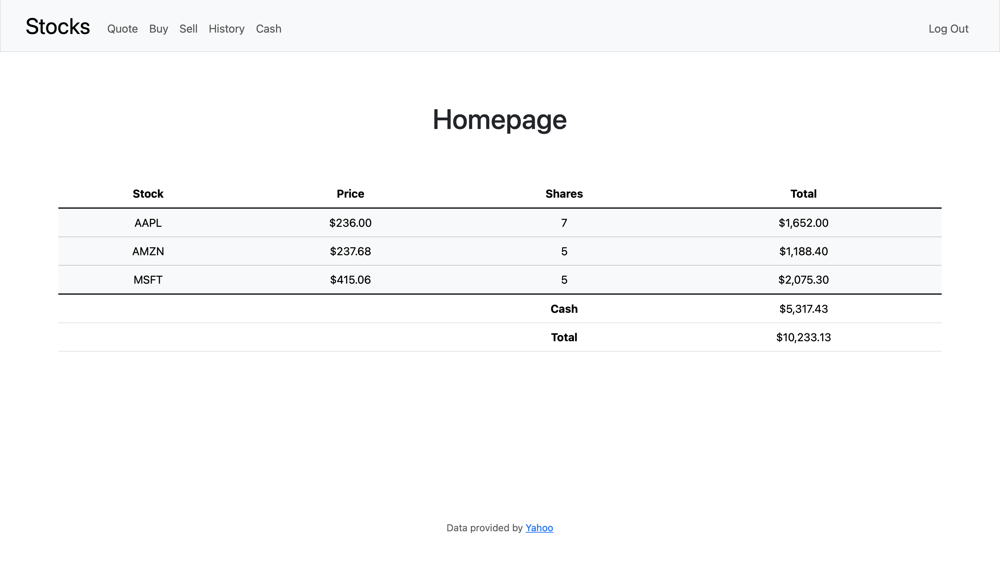

# Stocks




## Description
Stocks is a web application built using Python and Flask, allowing users to manage and track their stock investments. Users can buy, sell, and view their transaction history, as well as check the current stock price and manage their cash balance.

## Features
- Portfolio with current stock holdings, the ability to purchase stocks, and sell stocks.
- Check real-time prices of any stock.
- View a history of all your stock transactions.
- Add funds to your cash balance.
- Responsive and user-friendly design optimized for desktops, tablets, and mobile phones.
  
## Getting Started

### Prerequisites
- Python 3.x
- Flask
- SQLAlchemy

### Installation
1. Clone the repository:

    ```bash
    git clone https://github.com/Joherrer/stocks.git
    ```

2. Navigate to the project directory:

    ```bash
    cd stocks
    ```

3. Create a virtual environment:

    ```bash
    python3 -m venv venv
    ```

4. Activate the virtual environment:

    ```bash
    source venv/bin/activate
    ```
    
5. Install the required packages:

    ```bash
    pip install -r requirements.txt
    ```

6. Start the Flask application:

    ```bash
    flask run
    ```

7. Open your browser and go to `http://127.0.0.1:5000`.

## Usage
1. Register for a new account or log in if you already have one.

2. The **Home** page shows your portfolio, including the stocks you own, their values, and your total balance (cash + stock value).

3. Go to the **Quote** page and enter a stock symbol to check its current price.

4. Go to the **Buy** page, enter a stock symbol (e.g., "AAPL" for Apple), specify the number of shares, and purchase the stock. Your cash balance will be updated accordingly.

5. Go to the **Sell** page to sell stock you own. You can select the stock symbol and specify how many shares you want to sell.

6. The **History** page shows all your past transactions.

## Notes
- This app uses SQL and the SQLAlchemy database system to manage users, transactions, and stock data.
- The stock price data is fetched from an external API (Yahoo Finance).
- The app uses sessions for user authentication and account management.

## Contributions
Contributions are welcome! If you'd like to improve this project, please contact me before forking the repository, and submit a pull request with your improvements.

## License
Copyright (c) 2025 Jose Herrera. All rights reserved.